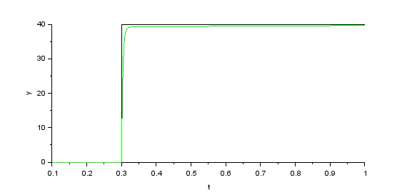

# PID-controller
<h3>PID controller for a 1st order system</h3>

Trnasfer Function(H(S)) =           0.3

                                  ------------   

 
                                  0.3 + S0.04

                                
Input x(t) = u(t)  
X(S)  = 1/S

Y(S) = H(S)X(S)
Y(S) =  0.3/(0.3+0.04S)S

y(t) = [1-exp(-7.5)t]u(t)

Time constant T =  0.04/0.3 = 0.133s

Kp = 40
KI = 50
KD = 0.01

